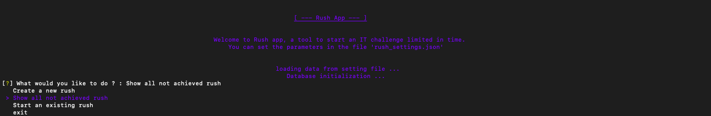
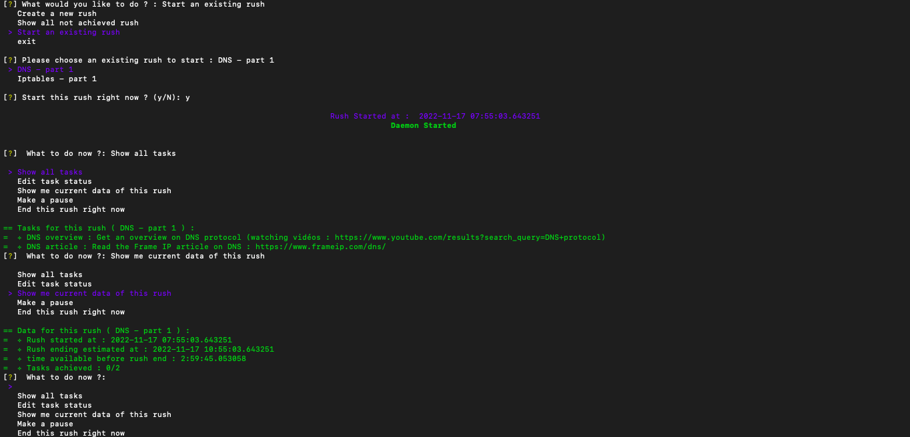

# Rush app

## Description

A terminal app (created with python) for managing rush [(my IT challenge limited in time)](https://github.com/Draed/rush/).

Built with (modules dependancies):
- cli_color_py (for colors)
- inquirer (for cli)
- sqlite3 (for ... sqlite)
- dominate (for HTML, used as template for pdf report)
- pdfkit (for creating pdf report)
- matplotlib.pyplot (for plot and graphs)

**OK but what does this app ?** 
<br>
It start a rush (a challenge, i.e : build a todolist app with flask in docker container) limited in time (by a countdown). It give me reminder after certain time to hydrate myself, do some stretch and globally having a healthy working session. After the countdown end (or when I finish all the tasks), the app generate a report in pdf for this rush and for all the rush, giving me statistics about what I learn, when, how often, how many pause I need, my concentration time,  ... which permit to improve my working methods (i.e : how lonf can I stay concentrated, how long  and how many pause, should I take ?)

I use this app to manage my learning session during my free time.

Some screenshot to illustrate the app : 

- Menu at start : 


- Menu during the rush :



Thind all my rush at : [rush repo](https://github.com/Draed/rush/)


## Usage : 

- With virtualenv (install dependancies and )
```
virtualenv -p python3 venv_rush_app && \
source venv_rush_app/bin/activate && \
pip install -r requirements.txt && \
python main.py
```

## Features 

### TODO : 

- Apply correction on bug which ask 2 times the launching question (start this rush right now ?)

<!-- - make the endtime equal to rush endtime if not "end this rush right now" -->
<!-- - add a currently working on task automatically to count time on it -->

- graph achieved task per hour

- generate global report for all rush : 
    - features and tasks accomplish 
    - number : 
        - total rush
    - graphs : 
        - by tags
        - by duration

### DONE : 

- add start_time for task
- add end_time for task
- add a regex validation for dates format (00:00:00)
- adding question for repo path at the end
- push last rush pdf report to rush repo
- add an option 'show me data' which show :
    - rush start time
    - rush time available
    - estimated rush end time
    - last pause (was for "name" at 'time')
    - ration : task done / total task
- change the end all task have been done
- generate pdf report for each rush : 
    - estimated time
    - duration
    - starttime
    - endtime
    - datetime (day)
    - tag
    - type
    - task list with infos
    - show the aar
- AAR (After Action Report) :
    - question : "would you like to write an AAR ?
    - advice in yellow : "How was this session, efficient , productive ?"
    - (if yes) just a text
- (if rush type not learning) scrum meeting question : 
    - Are you late ?
    - (if yes) why ?
    - Is it possible to make up for lost time ?
    - (if yes) How ?
- Pause feature to add : 
    - add choice "make a pause" 
- notifier for pause,coffee,physical activity, advancement report
- store each rush data on sqlite database
- scrum meeting feature
- add a notification at the end 

## sources : 

- pdf report with python : https://plotly.com/python/v3/pdf-reports/